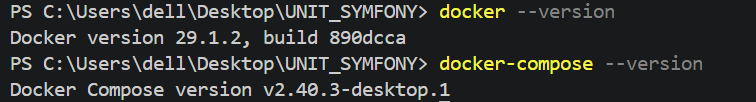
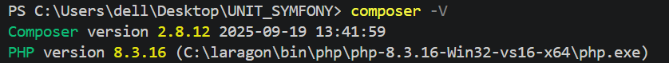
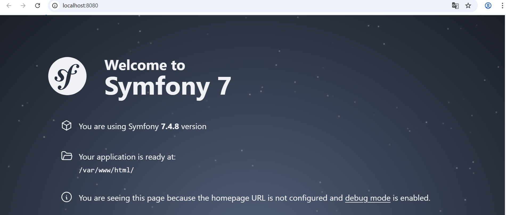
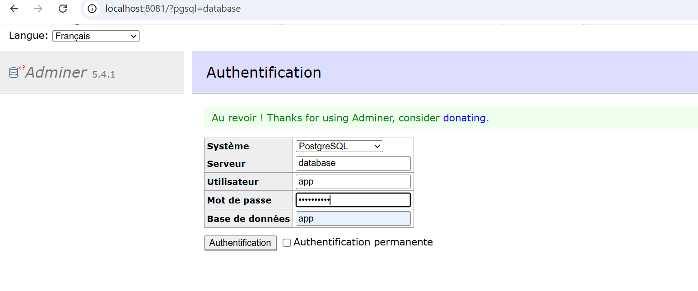
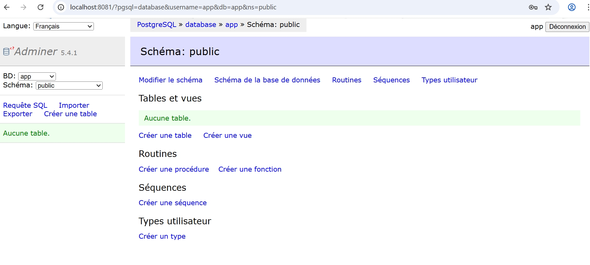
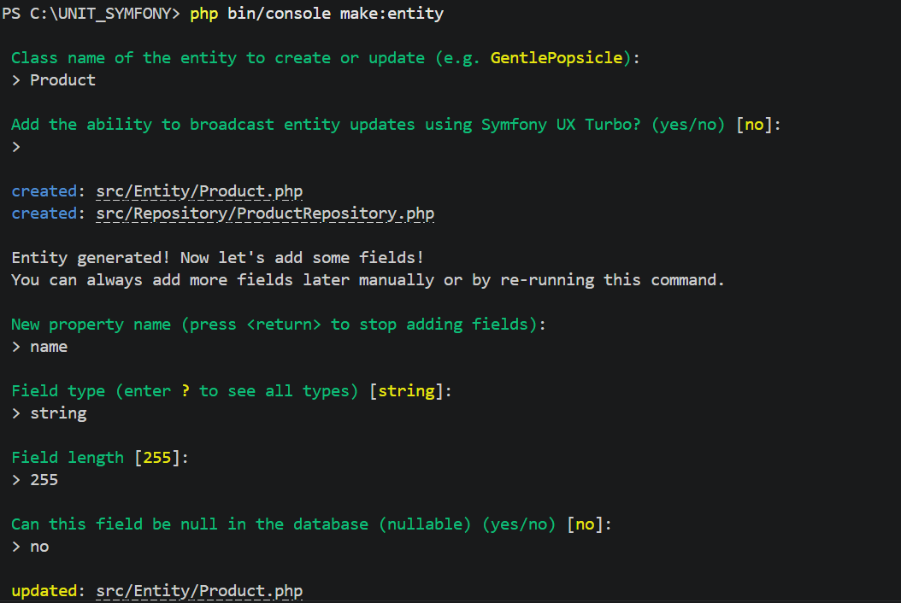
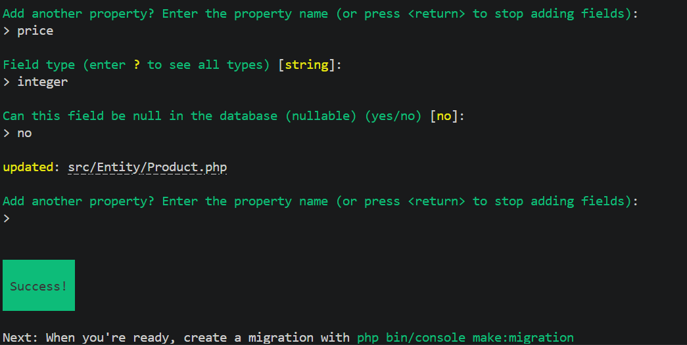

## Etape 1:Préparer l'environnement

Commande pour vérifier les versions de docker et de docker-compose et de composer:
docker --version
docker-compose --version

composer -V

## Etape 2:Créer un dossier de projet

## Etape 3:Préparer le fichier Docker compose

## Étape 4 :Préparer le fichier default.conf

## Étape 5 :Préparer le fichier Dockerfile

## Étape 6 :Installer Symfony

## Étape 7 :Tester l'application

on lance docker-compose via la commande docker-compose up --build et on accède au localhost:8080

On configure la base donnée et on accede à adminer après authentification

## Étape 8 :On crée une entité Product

